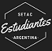

## Fundamentos de R para Científicos/as

<a href="https://setacsl2018.com/">SETAC San Luis 2018</a>

Universidad Nacional de San Luis 

16 de octubre 

### Presentación 

 El uso de R es un fenómeno relativamente reciente y muchos de los científicas/os que lo emplean con fines estadísticos carecen de entrenamiento en programación. Esto conlleva a que herramientas útiles para la visualización y limpieza de los datos sean poco conocidas, ya que son consideradas accesorias. El objetivo de este curso de 4 horas propuesto por los estudiantes SETAC es brindar un panorama de R para quienes quieran iniciarse o ampliar sus conocimientos sobre las posibilidades que brinda este lenguaje.

 Se abordarán los siguientes temas: 
 
  - ¿Cuál es la diferencia entre RStudio y R? ¿Me olvido de Excel? ¿Qué es un paquete?,
  - ¿Dónde buscar ayuda? La diferencia entre los paquetes del tidyverse y R base, 
  - Una figura para mi paper: gramática de gráficos y otras formas de visualización, 
  - ¿Eso lo hiciste con R? presentación breve de los paquetes Shiny y RMarkdown,
  - El camino hacia la ciencia reproducible: algunas prácticas deseables al momento de generar código para nuestras publicaciones. Se acompañará cada tema con sugerencias de material y tutoriales.

 R es un software libre que presenta un notable y creciente desarrollo por la comunidad. Se presentarán algunos grupos de usuarias/os representativas.

### Contacto 

<a href="mailto:estudiantessetac.arg@gmail.com ">Mail estudiantes SETAC</a>

### Material

Proximamente disponible

### URL
https://flor14.github.io/Fundamentos_de_R/

